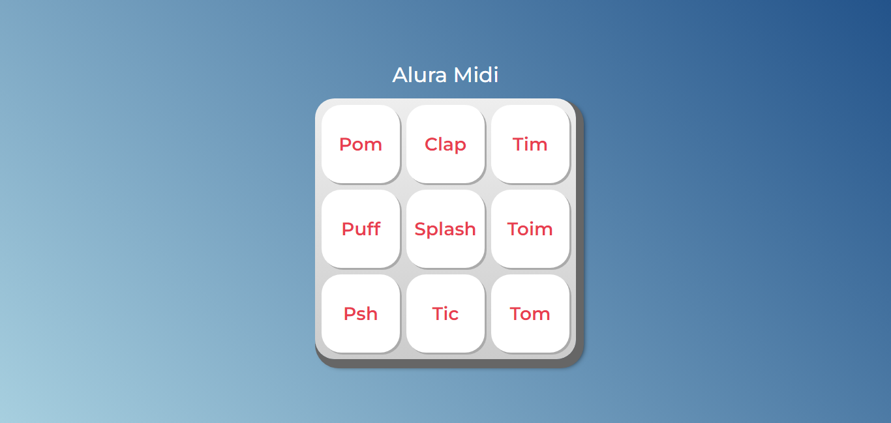

<h1 align="center">🥁 Alura Midi 🥁</h1>

<h3 align="center">O Alura Midi foi desenvolvido no curso de JavaScript para Web: Crie páginas dinâmicas na formação: Desenvolva aplicações Web com JavaScript. Da Alura.</h3>

 

  

## Tópicos

- [Imagem do projeto](#img)
- [Acesso ao projeto](#acesso)
- [Descrição do projeto](#desc)
- [Tecnologias utilizadas](#tec)
- [Status do projeto](#status)
- [Licença](#license)

 

<h2 id="img">🎻 Imagem do projeto</h2>

    

 

<h2 id="acesso">🔗 Acesso ao projeto</h2>

Clique [aqui](https://fel1324.github.io/AluraMidi/) para acessar o projeto.

 

<h2 id="desc">🎶 Descrição do projeto</h2>

O Alura Midi possui a funcionalidade de reproduzir alguns sons semelhantes a uma bateria.

 

<h2 id="tec">🚀 Tecnologias utilizadas</h2>

* HTML e CSS
* Javascript
* Git e Github

 

<h2 id="status">🚧 Status do projeto</h2>

✔️ Projeto Finalizado :)

 

<h2 id="license">📝 Licença</h2>

Esse projeto está sob a licença MIT.